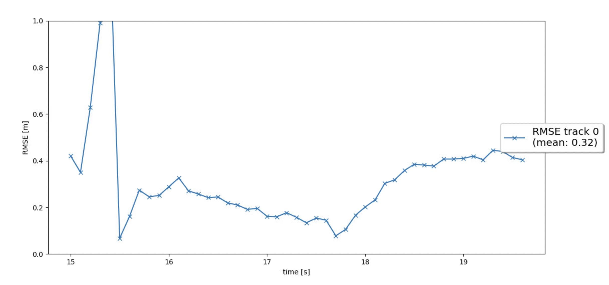
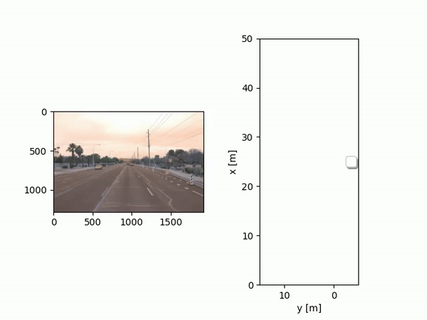
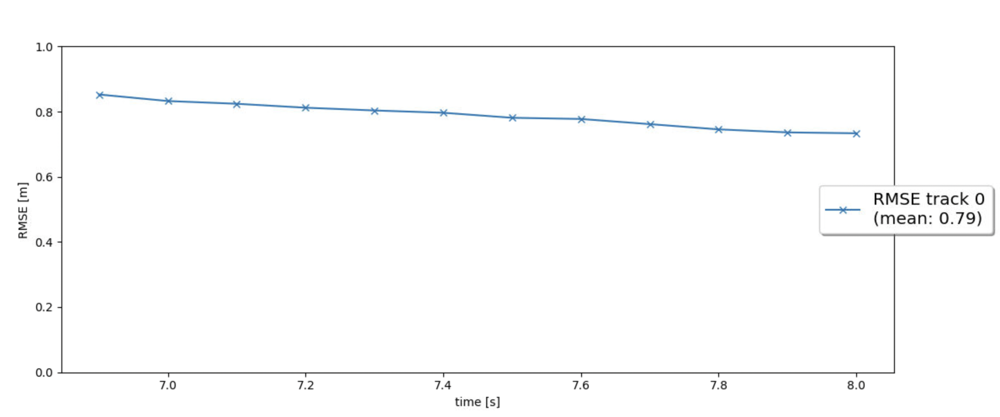
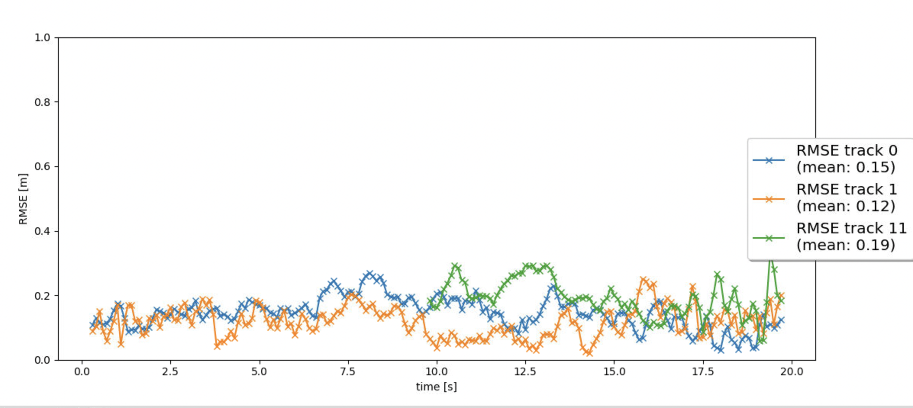
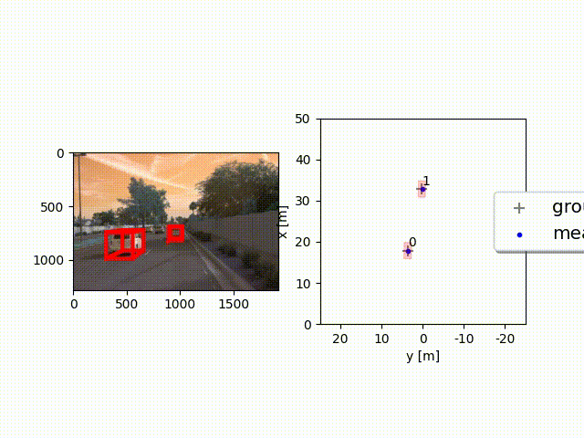
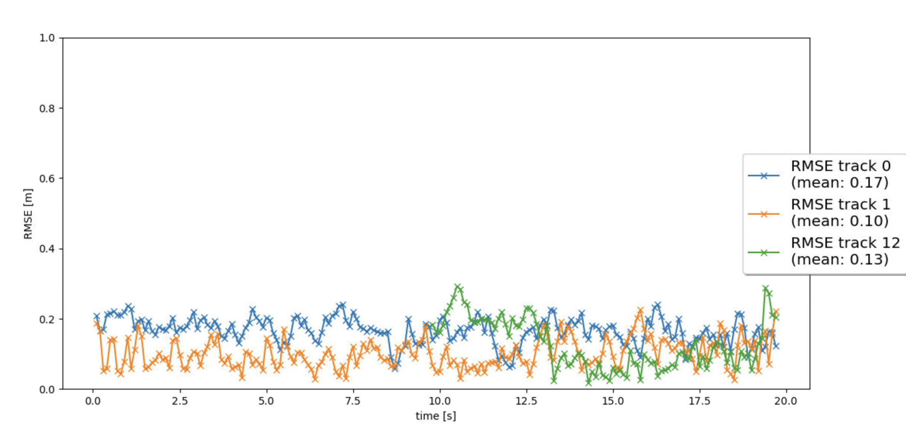

# Writeup: Track 3D-Objects Over Time

### Step 1: Implemented Extended Kalman Filter Algorithm (EKF) for estimation of other vehicles in 3D space.

For tracking a single vehicle, I achieved a RMSE score of 0.32

### Step 2: Track Management

Manage initialization of new detected vehicles, updating current tracks, and deleting old ones. Each track has a corresponding score value, which depicts the confidence score of the detection. Each track also has a state as either 'initialised', 'tentative', or 'confirmed'

### Step 3: Association of tracks and sensor measurements

Associate new measurements with current tracks using simple nearest neighbor to achieve multi-target tracking. Nearest neighbour is determined using Mahalanobis distance. 

### Step 4: Fuse measurements from camera along with Lidar

Implement camera model and perform multi-target tracking by fusing lidar and camera measurements.

### 2. Do you see any benefits in camera-lidar fusion compared to lidar-only tracking (in theory and in your concrete results)? 
Fusing data from many sensors is an advantage. Lidar can only measure distance and velocity, however, camera contains much richer features (RGB), and can be used for more accurate object detection and segmentation than lidar.
Comparing our results of lidar-only(step 2) and both lidar & camera (step 4), 
we achieve lower RMSE score, so, using sensors that complement each other strengths and weaknesses is great way for scene understanding.

### 3. Which challenges will a sensor fusion system face in real-life scenarios? Did you see any of these challenges in the project?
Using multiple sensors adds to the processing time of the incoming data, so, they need to be synchronized for accurate calculations. 
Also, many times, objects are detected by only one sensor, and not by others. Therefore, it takes a few frames for these unconfirmed objects to be detected, hence these objects can be challenging for real-time collision avoidance.

### 4. Can you think of ways to improve your tracking results in the future?
In this project, we are using traditional algorithms with a lot of hand engineering, like extended kalman filter. I think deep learning approaches may be more powerful for pose estimation and scene understanding. 
